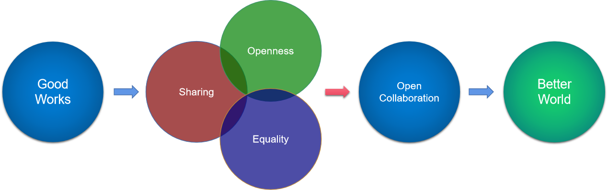

# 开源人宣言
# Open Source Fans Manifesto

* 中文版
* [English version](README_en.md)

我们是一群开源的爱好者与信仰者，我们相信：开源代表着一种向善的力量！作为一场席卷全球的世界性运动，20 多年来的历史证明，开源不仅仅能够孕育最新的技术、创造更好的软件，更能够帮助这个世界变得更好。

剖析开源的内涵，理解开源的精神，能够让我们理解，为何开源能够让世界变得更好。在我们看来，开源的精神体现在以下一些方面：

* **分享（Sharing）**

当一个软件工程师写出一个不错的软件，他不会敝帚自珍，不会故步自封。他乐于分享，是因为他相信：这个软件可能会对别人也有帮助，更会有人帮助他，一起做出更好的软件。西谚有云：赠人玫瑰，手留余香。我们都相信：**乐于分享是一切善举的开端。**

* **开放（openness）**

在很多方面，开放都非常重要。不仅仅是开放源代码，更包括公开透明的社区。这样的社区能够吸引更多的朋友加入。也能够帮助新来者，理解并认同社区规则。还能够促进监督以提升社区运行的程序正义。开放还包括欢迎一切的可能性，开源是世界的，也欢迎来自世界任何一个角落的使用者、参与者和贡献者。中国谚语有云：海纳百川，有容乃大。我们都相信：**公开透明是一切良好协作的基石。**

* **平等（Equality）**

我们欢迎任何人的任何贡献，我们以统一的标准平等地评审每一次代码或文档提交，我们评审的仅仅是代码或文档本身的质量与价值，而不是以贡献者的学历、年龄、种族、性别或职位等标准来判断。人皆生而平等，所以我们都相信：**对于平等的追求是社区健康的保障。**

* **协作（Collaboration）**

开源社区的协作，正是从接纳点滴贡献开始的，一个开放的社区，崇尚开放式的协作。这样的协作，不会在整个群体达成所有共识之后再开始，而是欢迎来自每一个人的一点一滴的改进。中国古语有云：不积小流，无以成江海。我们都相信：**开放式协作，逐步凝聚共识是社区繁荣的秘诀。**

* **创造美好世界（Build a better world）**

每一位投身开源的朋友，都或多或少是理想主义者。我们都相信：这个并不完美的世界，理应变得更好。我们都相信：通过自己掌握的技术，借助开源的方法，能够把这个世界变得更好。我们更加相信：开源的精神内涵，应该被推广到更多的领域。因为：**创造更加美好的世界，是开源的终极追求。**

开源社区的朋友都相信从我做起的力量，因此，我们发出如下行动倡议：

* **推而广之（Advocate widely）**

我们应该更加努力的向大众传播开源的理念与精神，让更多的人接受开源的理念，成为开源的同道中人。我们还应该在开源软件、开源硬件之外的领域，推广开源的实践，不仅仅是开放源代码，还应该开放数据、开放知识、开放一切可以帮助这个世界变得更好的知识与经验，让更多的行业、更多的群体，都接纳开源，成为开放式协作的受益者。

* **互帮互助（Help each other）**

我们应该帮助更多的开源项目，不断发展成长。帮助各个开源社区，把社区的力量团结起来，共同协作。我们还应该防止开源的含义被滥用或曲解。我们要阻止割裂，反对人为设置的障碍，反对任何附加歧视条款的“伪开源”，确保开源始终是一项惠及全球的事业。

* **立即行动（Just do it）**

每一个人都可以参与开源，而不是只有大咖才能做到。我们可以从翻译或撰写文档，纠正拼写做起，为代码除错，审核代码，提交代码，志愿支持开源活动，我们还可以布道演讲，吸引更多的朋友加入。

**结语**

面对一个急速变幻、急速下坠、甚至可能变得撕裂的世界，我们更应该推广开源的精神，凝聚众人向善之力，汇聚众人向善之智，开放协作、互惠共赢，为这个世界变得更好，做出贡献！
